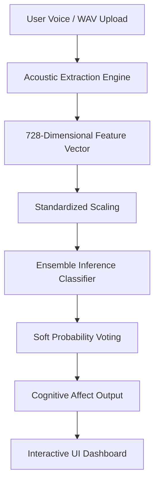

# VoxSentix AI 🎙️✨

> **Real-time Vocal Emotion Analytics & Cognitive Acoustic Profiler**

VoxSentix AI is a state-of-the-art Speech Emotion Recognition (SER) platform designed to extract, analyze, and classify emotional affect from raw vocal waveforms in real-time. Built upon high-dimensional statistical acoustics and a robust tree-based machine learning ensemble, VoxSentix AI offers cross-platform web intelligence to map vocal metrics with high precision.

---

## 🚀 Key Features

* **Real-time Voice Analysis:** Record audio directly from your browser to get instantaneous emotion predictions.
* **Dual Upload Modes:** Record live microphone feeds or drag-and-drop pre-recorded `.wav` and `.mp3` files.
* **Glassmorphic Interactive Dashboard:** A futuristic, responsive UI with instant performance metrics and theme controls.
* **Multilingual Sound Profiling:** Acoustic feature extraction translates across dialects (Urdu, English, etc.) by analyzing frequency, resonance, and pitch boundaries.
* **Tree-Based Ensemble Engine:** An offline training system combining Random Forests, Extra Trees, and Histogram Gradient Boosting with soft probability voting.

---

## 📊 System Architecture & Data Flow

VoxSentix AI runs on a decoupled structure: a high-fidelity static HTML5/CSS3/Vanilla JS frontend dashboard integrated with a Python Flask serverless backend.



### 1. The Signal Decomposition Pipeline
For every audio segment, the engine extracts a 728-dimensional acoustic map:
* **Zero Crossing Rate (ZCR):** Measures temporal fluctuations and spectral noise.
* **Root Mean Square (RMS) Energy:** Tracks volume boundaries and amplitude density.
* **Mel-Frequency Cepstral Coefficients (MFCCs):** Captures 40 frequency channels mapping vocal tract shapes.
* **Chroma STFT:** Determines harmonic structures and pitch class profiles.
* **Mel-Scaled Spectrogram:** Captures time-varying power spectrum distributions.

For each matrix, the system calculates four statistical bounds: **Mean, Standard Deviation, Maximum, and Minimum**, ensuring temporal variations are fully captured.

---

## 🛠️ Project Structure

```bash
├── app.py                      # Flask API Server
├── requirements.txt            # Python Dependencies
├── vercel.json                 # Vercel Serverless Deployment Config
├── best_production_model.keras  # Trained Keras Model (Ensemble Backup)
├── best_ser_model.keras         # Trained Keras Model (Primary SER)
├── frontend/                   # Static Frontend Files
│   ├── index.html              # Main SPA Layout
│   ├── css/
│   │   └── styles.css          # Futuristic Redesigned Stylesheet
│   └── js/
│       └── engine.js           # Navigation, Visualizer & API handler
└── src/                        # Model Training Source
    ├── train_engine.py         # Advanced Ensemble Training Pipeline
    └── models/
        └── production_ser_ensemble.joblib # Serialized Ensemble Artifacts
```

---

## 💻 Local Quickstart

### Prerequisites
* Python 3.9+
* Node.js (Optional, for frontend development)

### Setup Instructions
1. **Clone the repository:**
   ```bash
   git clone https://github.com/Shahbaz4462/CodeAlpha-Emotion-Recognition.git
   cd CodeAlpha-Emotion-Recognition
   ```

2. **Create a virtual environment & install dependencies:**
   ```bash
   python -m venv venv
   source venv/bin/activate  # On Windows use: venv\Scripts\activate
   pip install -r requirements.txt
   ```

3. **Run the Flask application:**
   ```bash
   python app.py
   ```
   Open your browser and navigate to `http://localhost:8000`.

---

## 🌐 Serverless Deployment on Vercel

This repository is optimized for one-click deployment to **Vercel** utilizing Python Serverless Functions.

### Deployment Guide:
1. Push your latest code changes to your GitHub repository.
2. Go to your [Vercel Dashboard](https://vercel.com/dashboard).
3. Click **Add New** -> **Project** and import your repository.
4. Keep the framework preset as **Other** (Vercel will read `vercel.json` automatically).
5. Click **Deploy**. Vercel will install Flask, compile your routes, and deploy the application.

---

## 📧 Contact & Collaboration

If you have questions, feedback, or want to collaborate, feel free to reach out:

* **Name:** Muhammad Shahbaz
* **Email:** [shahbaz04462@gmail.com](mailto:shahbaz04462@gmail.com)
* **Phone:** [0305-8804309](tel:03058804309)
* **GitHub:** [Shahbaz4462](https://github.com/Shahbaz4462)
